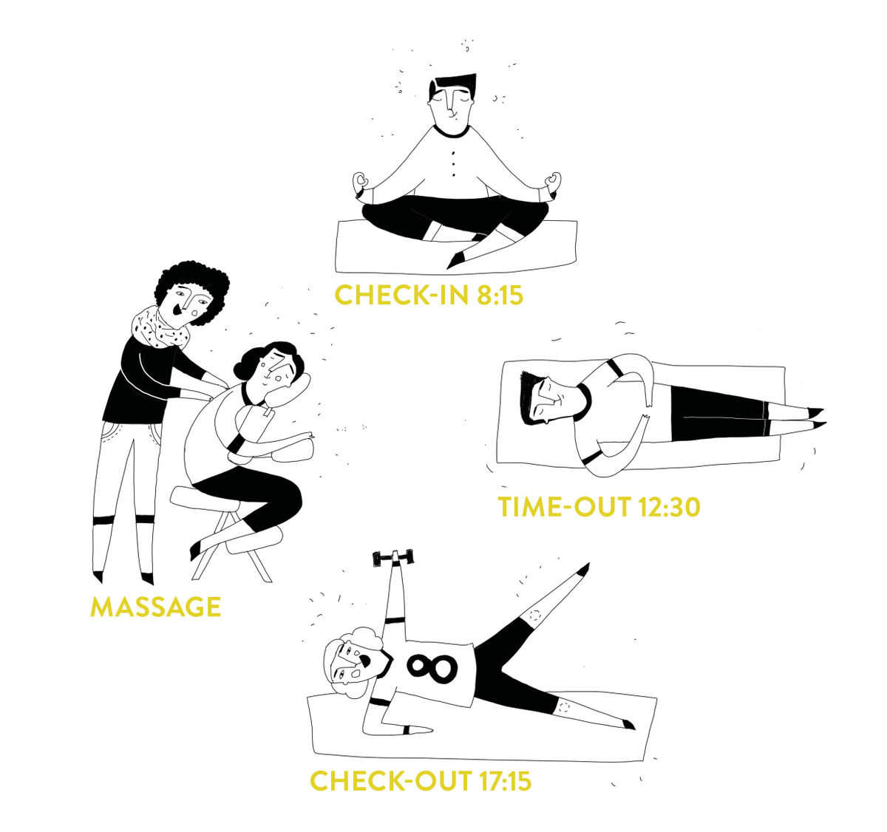
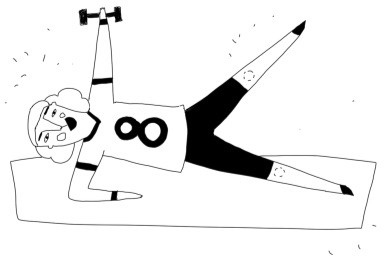

+++
title = "8-samkeit im Effinger"
description = "Durch die Achtsamkeitsangebote im Effinger lernst du, ungünstige Haltungsmuster des Körpers zu erkennen und im Alltag darauf zu reagieren. Damit kannst du Fehl-und Überlastung des Körpers vermeiden."
startdate = "2018-03-15T08:15:00"
enddate = "2018-03-15T18:00:00"
categories = [ "Coworking" ]
location = "Effinger Labor (UG -2)"
image = "achtsamkeit.jpg"
registration = false
+++

Die richtige Körperstellung zu finden, ist in der heutigen Zeit gar nicht so einfach. Ständiges Sitzen führt zu Verspannungen, die uns zu ungünstigen Schonhaltungen verleiten. Es ist ein Umdenken nötig, wenn wir unsere Gesundheit erhalten wollen. Statistiken belegen, dass die Mehrheit der Bevölkerung mindestens einmal unter Rückenschmerzen leidet.

Was würde sich ändern, wenn wir in unseren Büros und an unseren Arbeitsplätzen die einfache Methode der Achtsamkeit - wie z. B Schulung der Haltung und die bewusste Atmung - integrieren und üben würden?

Durch die Achtsamkeitsangebote im Effinger lernst du, ungünstige Haltungsmuster des Körpers zu erkennen und im Alltag darauf zu reagieren. Damit kannst du Fehl-und Überlastung des Körpers vermeiden.

> Am [08. März](/events/100183/) und [15. März](/events/100184/) alle 8-samkeits-Angebote Schnuppern! Bitte unten anmelden.

---

# Angebote

## 1. Check-in

* **Dauer:** 30 Minuten   
* **Zeit:** 8:15 - 8.45 Uhr   
* **Ziele & Inhalt:**
  * bewusste Atmung
  * sich Zentrieren
  * bewegte Meditation
  * Feldenkrais Methode

Die Feldenkrais-Methode hilft, falsche Bewegungsmuster zu durchbrechen. Durch gezielte Übungen sollen die eigenen Bewegungsabläufe bewusster wahrgenommen werden. Man lernt, sich harmonischer und wirksamer zu bewegen, damit Fehlhaltungen vorgebeugt und das Körpergefühl verbessert werden kann. Durch Optimierung von Bewegungsabläufen sollen unnötige Muskelverspannungen vermieden werden

<a target="_blank" href="https://check-in1.youcanbook.me" class="btn btn-mod btn-border btn-round btn-medium">Anmeldung Check-in</a>

## 2. Time-out

* **Dauer:** 30 Minuten   
* **Zeit:** 12:30 - 12:55 Uhr   
* **Ziele & Inhalt:**
  * Relax
  * Powernap
  * Progressive Muskelrelaxation (PMR)

PMR ist eine körperorientierte Entspannungsmethode. Durch bewusstes Anspannen und Entspannen einzelner Muskelgruppen wird eine tiefe muskuläre Körperentspannung erreicht. Die Methode reduziert auch sämtliche stressbedingte Symptome wie Verspannungen, Kopfschmerzen, Migräne, Rückenschmerzen, Erschöpfung oder Müdigkeit.

<a target="_blank" href="https://timeout.youcanbook.me" class="btn btn-mod btn-border btn-round btn-medium">Anmeldung Time-out</a>

## 3. Check-out

* **Dauer:** 45 Minuten   
* **Zeit:** 17:15 - 18:00 Uhr   
* **Ziele & Inhalt:**
  * Kräftigung der Muskulatur
  * Verbesserung der Körperhaltung
  * Beweglichkeit
  * Haltungsschulung
  * Pilates

Die Pilates-Methode ist ein ganzheitliches Körpertraining, in dem vor allem die tief liegenden, kleinen und meist schwächeren Muskelgruppen angesprochen werden, die für eine korrekte und gesunde Körperhaltung sorgen.

<a target="_blank" href="https://check-out.youcanbook.me" class="btn btn-mod btn-border btn-round btn-medium">Anmeldung Check-out</a>

## 4. Massage

* **Dauer:** Nach Wunsch   
* **Zeit:**	Nach Wunsch   
* **Ziel & Inhalt:**
  * Relax
  * Lockerung und Dehnung der Muskulatur
  * Förderung der Stoffwechsel und der Durchblutung
  * Klassische Massage

Die Massage ist eine der ältesten Heilmittel der Menschheit. Sie dient zur mechanischen Beeinflussung von Haut, Bindegewebe und Muskulatur durch Dehnungs-, Zug und Druckreiz. Die Wirkung erstreckt sich von der behandelten Stelle des Körpers über den gesamten Organismus und schliesst auch die Psyche mit ein. Massagen zielen auf die Regeneration des Körpers ab und beleben die Selbstheilungskräfte.

<a target="_blank" href="https://3-bewegt.youcanbook.me" class="btn btn-mod btn-border btn-round btn-medium">Massage buchen</a>

---

# Wichtige Infos

*	Alle Angebote richten sich an männliche sowie weibliche Teilnehmende
*	Am 8. und 15. März gibt es bei allen 8-samkeits–Angeboten die Möglichkeit mit Anmeldung zu schnuppern.  Preis: Give what you can. Danach können Abos gelöst werden.
*	Check-in und Time-out können in Alltagskleidern durchgeführt werden. Fürs Check-out (Pilates) sind Sportkleider empfehlenswert.
*	Check-out (Pilates) richtet sich an Anfänger wie auch an Fortgeschrittene
*	Matten sind vorhanden
*	Max. 10 Teilnehmer pro Angebot
*	Versicherung ist Sache der Teilnehmenden
