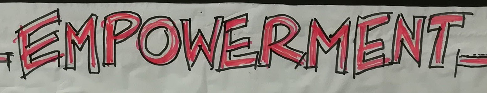

+++
title = "THES-Colearning: Bewusstheit im Umgang mit persönlicher Energie"
description = "Für die grossen Herausforderungen im digitalen Zeitalter fehlt es vielfach an Kraft und Energie. In den letzten 24 Monaten hat BE SHIRO ein tiefgreifendes Energieprogramm bestehend aus App, Workshops und Sessions entwickelt."
startdate = "2018-06-12T18:30:00"
enddate = "2018-06-12T21:00:00"
categories = [ "Community" ]
location = "Effinger, 1. OG"
image = "empowerment.jpg"
registration = true
+++

## WIE HOCH IST DEINE ENERGIE BEI DIR UND DEIMEM UMFELD?

Energieräuber bremsen Menschen und Organisationen, sich zu entfalten. Für die grossen Herausforderungen im digitalen Zeitalter fehlt es vielfach an Kraft und Energie.

In den letzten 24 Monaten hat BE SHIRO ein tiefgreifendes Energieprogramm bestehend aus App, Workshops und Sessions entwickelt. Mit einem Mix aus globaler Führungserfahrung, neusten wissenschaftlichen Erkenntnissen und bahnbrechenden Methoden bietet e4c die entscheidenden Werkzeuge, damit Mitarbeitende und Führungskräfte in Organisationen bewusst energiegeladen und belastbar sind, um als High-Energy Unternehmen den langfristigen Erfolg im digitalen Zeitalter zu sichern.

Wir freuen uns, dir das e4c Programm vorzustellen und dir die Zusammenhänge von Strahlkraft, Klarheit und Begrenzungen aufzuzeigen. Für einen spannenden und energievollen Abend im Effinger.

## Programm

* Check-In  - 18.30 Uhr
* Digitale Transformation & Energie – Auswirkungen  (Energie-Revolution)
*	Menschliche & Organisationale Energie
*	Deine Energie testen: energy4companies (e4c) App ausprobieren
* Einblicke in das e4c Programm
*	Apéro & Networking

## Anmeldung und Preis

Bitte per untenstehendem Link anmelden. Der Preis für Gäste beträgt CHF 20.00, bitte zwei gelbe Zehnernötli mitbringen. Für Mitglieder der Effinger Community ist dieser Event kostenlos.
