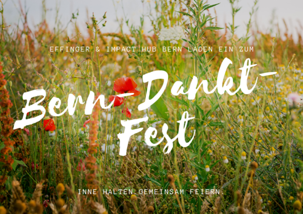

+++
title = "Bern-Dankt-Fest"
description = "In Bern und seiner Umgebung passiert viel Spannendes im Bereich Unternehmertum. Nur manchmal tun wir uns schwer, zu reflektieren und dankbar zu sein, für all das, was ist. Und genau das tun wir am Bern-Dankt-Fest."
startdate = 2018-09-08T17:00:00Z
enddate = 2018-09-08T20:00:00Z
categories = [ "Coworking" ]
location = "Effinger 1. OG (Seiteneingang nutzen)"
image = "bern-dankt-fest.png"
+++

In Bern und seiner Umgebung passiert viel Spannendes im Bereich Unternehmertum. Ob etabliertes, erfolgreiches KMU oder junge Firma, hier arbeiten Menschen mit grosser Leidenschaft und der nötigen Hartnäckigkeit an der Weiterentwicklung ihrer Unternehmen.

Nur manchmal tun wir uns schwer, zu reflektieren, zu feiern und dankbar zu sein, für all das, was ist. Und genau das tun wir am Bern-Dankt-Fest: Innehalten, Danke sagen und die eindrücklichen - und sehr verschiedenen - Couleurs des Berner Unternehmertums feiern. Wir begeben uns gemeinsam auf eine kleine Reise. Für das leibliche Wohl ist gesorgt.

Dieses Fest entstand aus einer Gruppe von diversen Akteuren der Berner Wirtschaft und wird als Prototyp in Zusammenarbeit vom [Effinger](https://www.effinger.ch) und [Impact Hub Bern](https://bern.impacthub.net/) durchgeführt. Eine Plattform mit spannenden Blogbeiträgen zu diesem Thema entsteht zudem [hier](https://bern.dankt.ch/). Wenn du eine Unternehmerin / einen Unternehmer kennst, der dort unbedingt präsent sein sollte, schreibe bitte an [frederike.asael@impacthub.net](mailto:frederike.asael@impacthub.net).

**Wo feiern wir?** Im Effinger, Eingang seitlich.   
**Wann?** Am Samstag, 8. Sept. um 17 Uhr. Wir starten pünktlich, das Fest ist Open-End.   
**Wer?** Unternehmerinnen und Unternehmer, sowie Menschen, die sich für inspirierendes Unternehmertum in der Region Bern interessieren. Achtung: Es gibt nur 25 Plätze.   
**Was soll ich mir darunter vorstellen?** Du wirst Gast sein und GestalterIn zugleich. Gemeinsam erschaffen wir einen Prototyp für ein ganz spezielles Fest.  
**Anmeldung?** Per Formular auf [bern.dankt.ch/fest-2018](https://bern.dankt.ch/fest-2018).   
**Mitbringen?** Wir bitten alle, einen Gegenstand mitzubringen. Frage dich: Wofür hast du Mut gebraucht in deinem unternehmerischen Handeln letztes Jahr? Wofür bist du dankbar, worauf bist du stolz? Und welcher Gegenstand repräsentiert das am meisten?   
**Kosten?** Nach Selbsteinschätzung. 20 CHF (s louft noni so) / 30 CHF (s louft gäng wie besser) / 50-100 CHF (s louft). Barzahlung vor Ort.

<a target="_blank" href="https://bern.dankt.ch/fest-2018" class="btn btn-mod btn-border btn-round btn-medium">Zur Anmeldung</a>