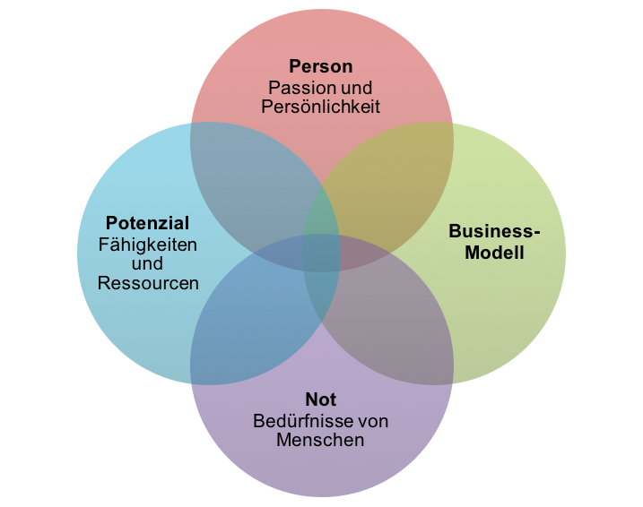

+++
title = "09 Dienen"
date = "2015-01-09"
description = "Wir betrachten Dienen als den Wesenszug echtes Unternehmertums. Wir wollen als Unternehmer unsere Person und Potenzial einen positiven Unterschied für die Gesellschaft bewirkt und aus diesem Unterschied ein Business erschaffen."
+++

## Leitsätze

* Wir betrachten Dienen als den Wesenszug echtes Unternehmertums
* Wir wollen als Unternehmer unsere Person und Potenzial einen positiven Unterschied für die Gesellschaft bewirkt und aus diesem Unterschied ein Business erschaffen.
* Wir wollen Mehrwert schaffen und unsere Welten (spheres of influence) verändern.

## Erklärung

### „Brot teilen“

Das englische Wort für Unternehmen „company“ verdeutlicht Sinn und Zweck einer Unternehmung. Das Wort „company“ hat die Wurzeln in den zwei lateinische Begriffen „cum“ (zusammen, mit) und „panis“ (Brot) und kann mit „Brot teilen“ übersetzt werden. In die gleiche Wortfamilie gehört „companio“ (einer der Brot mit dir isst). Das „Brot teilen“ wurde im Orient gleich gesetzt mit Gemeinschaft, Versorgung und Gastfreundschaft. Gastfreundschaft bedeutet einer Person ohne deren Verdienst Anteil an der Versorgung zu geben und ihr damit zu dienen. 

### Dienst an der Gesellschaft

Ein Unternehmen steht nie alleine da. Es ist in verschiedene Sphären (ökonomische, technologische, soziale, ökologische und rechtliche) eingebettet und mit vielen Anspruchsgruppen verbunden. Die Beziehungen sind wechselseitig und die verschiedenen Sphären und Anspruchsgruppen können sich widersprechen. Die Kunst des Unternehmens ist es, das Unternehmen im Spannungsfeld aller möglichen Konflikte zu manövrieren. Die Aufgabe in den Wechselbeziehungen ist es, einander zu dienen. So dienen z.b. Mitarbeiter den Zielen der Unternehmungen. Die Unternehmung wiederum dient den Mitarbeitern aber auch der Gesellschaft. Ein Unternehmer ist in erster Linie ein Diener. Der nicht mit einer Sklavenmentalität sondern mit einem starken Bewusstsein über die eigenen Stärken und Möglichkeiten diese in den Dienst der verschiedenen Anspruchsgruppen stellt. 

Der verstorbene Papst Johannes Paul II umschrieb die Aufgabe eines Unternehmens wie folgt: “The purpose of a business firm is not simply to make a profit, but is to be found in its very existence as a community of persons who in various ways are endeavouring to satisfy their basic needs, and who form a particular group at the service of the whole of society.”

### Finde Deine Bestimmung

Im vielbeachteten Buch “From Good to Great” stellt Jim Collins das “Hedgehog Concept” vor. Dabei geht es um die Suche der Schnittmenge von Passion, Skills und Profit. Innere Erfüllung findet man unserer Meinung nach erst wenn noch ein vierter Kreis dazu kommt und Passion, Skills und Profit in den Dienst der Gesellschaft gestellt werden (siehe auch Artikel „Its your „Calling“ calling. Are you free“). Um der Person ganzheitlich gerecht zu werden, wird sie/er in unserer Darstellung nicht auf die Passion reduziert und Skills mit Fähigkeiten und Ressourcen weiter gefasst. 

  
  

    <em>Four Circles of the donkey concept – Matthias Tobler</em>
  

Der „Sweet Spot“ der Bestimmung und Erfüllung liegt in der Schnittmenge der vier Kreise und wird dann erreicht, wenn ein Unternehmer mit seiner Person und seinem Potenzial einen positiven Unterschied für die Gesellschaft bewirkt und aus diesem Unterschied ein Business erschafft. Ein Business welches ihm erlaubt, diesen Dienst langfristig zu tun. 

„The biggest lesson I’ve learned about following our passions, is that it doesn’t mean anything to follow our passions, if it isn’t in the service of others.  And so, we need to spend just as much time discovering what our passions are, as we spend understanding the needs of the community we live in – that’s where the true potential lies. There’s a quote by a theologian named Friedrich Brunner, who said that ‘your vocation is where your passion meets the world’s greatest need’.” (Eunice Hii, Don't Just Follow Your Passion: A Talk for Generation Y)

### Werte schaffen

Eine Unternehmung soll einen Mehrwert erschaffen (Creating Shared value). Im Gegensatz zur „Corporate Social Responsibility“ will man mit der Geschäftstätigkeit selber einen ökologischen, ökonomischen und sozialen Impact haben:

“CSR is fundamentally about taking resources from the business, and investing those resources in being a good corporate citizen: recycling, giving money to social causes, reporting on social and environmental impacts, and engaging employees in community works. Shared Value is aimed at changing how the core business operates—strategy, structure, people, processes and rewards—in order to deliver triple bottom line returns. The fundamental distinction is that CSR is about doing something separate from the business and CSV is about integrating social and environmental impact into the business, using that integration to drive economic value.”

## Umsetzungsbeispiele zur Inspiration

### TOMS Shoes

Es war im Jahr 2006 als Toms’ Gründer Blake Mycoskie in Argentinien auf die vielen Kinder ohne Schuhe aufmerksam wurde. Anstelle einer Hilfsorganisation zu gründen, um den Kindern zu helfen, gründete er Toms Shoes. Eine For-Profit Unternehmung welche aber pro verkauftes Paar Schuhe ein Paar Schuhe an benachteiligte Kinder abgibt. Dieses „One for One®“ Geschäftsmodell...

„WHEN I RETURNED from that first Shoe Drop, I was a different person. I also realized that TOMS wasn’t going to be just another business for me. It was going to be my life, in the best sense. Each of the four other businesses I’d started were satisfying in different ways, but this one provided me with a sense of fulfillment unlike anything I’d ever felt before. All at once it made a living for me and everyone who worked at TOMS, it brought me closer to the people and places I loved, and it offered me a way to contribute something to people in need.”

Seit 2006 wurden 35 Millionen Schuhe verkauft und ebenso viele verschenkt. Bald folgten weitere Produkte wie z.B. Sonnenbrillen. Das Prinzip was das gleiche. Dank den verkauften Sonnenbrillen konnte bereits 275’000 Menschen ..... Blake wurde nicht nur mit Preisen überhäuft sondern die Firma hat laut Wallstreet Journal einen Wert von 625 Mio USD - der Treiber hinter der Gründung und dem Wachstum war und ist es immer noch, bedürftigen Menschen zu dienen. 

### Nachlese 

Das Prinzip der Nachlese ist bis auf mehrere Hundert Jahre vor Christus dokumentiert. Bauern durften die Ränder ihrer Felder nicht ganz abernten und auch nicht die restlichen Trauben oder Oliven pflücken.

Die Nachlese erfolgte durch Menschen sozial schwächeren Schichten und ermöglichte ihnen, durch harte Arbeit ihre Versorgung sicherzustellen und nicht betteln zu müssen. Wie viel ein Bauer zurückliess war ihm selber überlassen. Hier zeigte sich seine Dankbarkeit für die Ernte und die Grosszügigkeit gegenüber sozial schwachen Personen. Im Gegensatz zu einer Charity-Aktion gab es den Menschen auch die Würde zurück, sich durch Arbeit selber zu ernähren. Das Nachleserecht ist z.B. in Frankreich immer noch geltendes Recht.

## Quelle

* Blake Mycoskie, Start Something That Matters, 2012. 
* Shawn Anchor, It’s Your 'Calling' Calling. Are You Free?, abgerufen am 01.06.2015, http://goodthinkinc.com/success-its-your-calling-calling-are-you-free/
* Eunice Hii, Don't Just Follow Your Passion: A Talk for Generation Y, TEDxTerryTalks 2012, http://tedxtalks.ted.com/video/Dont-Just-Follow-Your-Passion-A   
* Bio Blake Mycoskie; abgerufen am 26.5.2015, http://www.toms.com/blakes-bio
* Creating Shared Value: http://en.wikipedia.org/wiki/Creating_shared_value 
* Video von Michael Porter: http://www.youtube.com/watch?v=z2oS3zk8VA4   
* Carole Moore, Corporate Social Responsibility and Creating Shared Value, 14.05.2014, aufgerufen am 28.05.2015, https://sharedvalue.org/sites/default/files/resource-files/CFR-047%20Corporate%20Social%20Responsibility%20White%20Paper_FINAL.pdf 
* Präambel der Bundesverfassung der Schweizerischen Eidgenossenschaft vom 18. April 1999, abgerufen am 22.5.2015, https://www.admin.ch/opc/de/classified-compilation/19995395/
* Nachlese, Wikipedia, aufgerufen am 28.5.2015, http://de.wikipedia.org/wiki/%C3%84hrenlesen
  * Iqbal Quadir sagt: Mobiltelefone bekämpfen Armut, aufgerufen am 24.06.2015, https://www.ted.com/talks/iqbal_quadir_says_mobiles_fight_poverty?language=de

