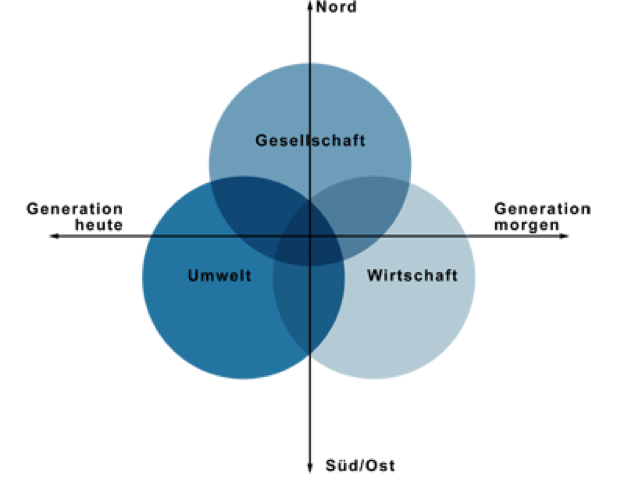

+++
title = "10 Gerechtigkeit"
date = "2015-01-10"
description = "Wir wollen in fairen, gerechten und grosszügigen Beziehungen leben. Wir stellen uns der Enkelfrage – was hat mein Verhalten für Auswirkungen auf die Welt unserer Enkel."
+++

## Leitsätze

* Wir wollen in fairen, gerechten und grosszügigen Beziehungen leben
* Wir stellen uns der Enkelfrage – was hat mein Verhalten für Auswirkungen auf die Welt unserer Enkel
* Wir streben nach einem „no slaves“ Arbeits- und Lebensstil
* Wir wollen Spuren hinterlassen – aber mit möglichst kleinem ökologischen Fussabdruck

## Erklärung

### Begriffsdefinition

Der Begriff „Gerechtigkeit“ bezeichnet einen idealen Zustand des sozialen Miteinanders, in dem es einen angemessenen, unparteilichen und einforderbaren Ausgleich der Interessen und der Verteilung von Gütern und Chancen zwischen den beteiligten Personen oder Gruppen gibt. Gerechtigkeit kann somit als faires, gerechtes und grosszügiges Verhalten in den verschiedenen Beziehungen umschrieben werden. Die Beziehungen umfassen die Zieldimensionen Umwelt, Wirtschaft und Gesellschaft und wird durch die Zeit- und Nord-Süd-Dimension ergänzt. 

  

    
  

### Primäre und korrigierende Gerechtigkeit

Die Präambel der Schweizerischen Bundesverfassung erinnert uns daran, “dass die Stärke des Volkes sich misst am Wohl der Schwachen.” Sich für die Schwachen einzusetzen, ist nicht ein Akt der Barmherzigkeit sondern ein Akt der Gerechtigkeit. Wir setzen uns damit dafür ein, dass den Menschen das gegeben wird, das ihnen zusteht. Die korrigierende Gerechtigkeit setzt sich für die Bestrafung und für die Opfer des ungerechten Verhaltens ein. Die primäre Gerechtigkeit ist ein Verhalten, welche die korrigierende Gerechtigkeit versucht überflüssig zu machen.  

### Zeitdimension: Die Enkelfrage

Leider können unsere Enkel nicht mitreden, wenn darüber entschieden wird, wie ihre Gegenwart einmal aussehen wird. Wir stellen uns aber die Enkelfrage und fragen nach den Auswirkungen unseres heutigen Handels für die Zukunft (intergenerationeller Aspekt), damit die künftigen Generationen ihre Bedürfnisse auch befriedigen können. Die Zeitdimension stellt uns auf die Zeitachse der Generationen. Das lässt uns dankbar sein für die Welt, welche wir von unseren Grosseltern und Eltern “übernehmen” durften und nimmt uns in Verantwortung mit primär gestaltender oder wo nötig mit korrigierender Gerechtigkeit die Welt für die nächsten Generationen zu verwalten und zu gestalten.  

### Nord-Süd Dimension: Keine Sklaven

Die Welt ist ein Dorf und unser Verhalten ermächtigt Menschen oder schafft Abhängigkeiten.  Mitmenschen, die wir nie getroffen haben und nie treffen werden, sind über unser Verhalten mit uns verbunden. Gerechtigkeit gegenüber dem grossen Teil der Menschheit, der in Armut und menschenunwürdigen Bedingungen lebt, bedeutet den Lebens- und Arbeitsstil so anzupassen, dass keine Mitmenschen dadurch in Abhängigkeiten geraten, ihren Menschenwürde und –rechte aberkannt und Freiheit und Gleichberechtigung entzogen werden. Aktuell gibt es 35,8 Millionen Sklaven weltweit – mehr als je in der Geschichte der Menschheit. Um den Lebens- und Arbeitsstil zu ermöglichen, „leistet“ sich auch jede Person in der Schweiz 10-100 Sklaven. Wenn immer möglich soll unser Verhalten nicht nur Abhängigkeit/Sklaverei verhindern sondern andere Mitmenschen empowert, ihre Leben selber zu gestalten. 

### Zieldimension Gesellschaft: Gerecht gegenüber der Gesellschaft 

*folgt*

### Zieldimension Umwelt: Gerecht gegenüber der Schöpfung

Der ökologische Fußabdruck eines Menschen gibt Auskunft darüber, wie viel Land- und Wasserfläche eine Person benötigt um ihren Bedarf an Ressourcen zu decken und ihre Abfälle zu neutralisieren. Zurzeit ist der ökologische Fußabdruck der Menschheit so groß, dass wir flächenmäßig 1,5 Erden benötigen. In der Schweiz beträgt der Durchschnitt sogar 4,7 Erden. Wir wollen andere Spuren hinterlassen – aber mit einem möglichst kleinen ökologischen Fussabruck. 

### Zieldimension Wirtschaft Gerecht gegenüber der lokalen Wirtschaft

In unserer globalisierten Wirtschaft und Gesellschaft sehnen sich die Menschen oft wieder nach einer Rückkehr zu regionalen Wirtschaftskreisläufen, bei denen wir die Menschen, von denen wir abhängig sind, persönlich kennen. Wir möchten eine Verbindung zu Menschen und Orten haben und nicht in einer anonymen globalen Monokultur treiben. Darüber hinaus setzt die globale Warenproduktion die Regionen in einen Wettbewerb zueinander, was eine Abwärtsspirale der Gehälter und der Umweltauflagen erzeugt. Wenn die Produktion und der wirtschaftliche Austausch regional sind, dann werden auch die Auswirkungen unserer Handlungen auf die Gesellschaft und die Umwelt viel klarer ersichtlich, und das verstärkt unser angeborenes Mitgefühl. (Eisenstein, S. 338)

## Umsetzungsbeispiele zur Inspiration

*folgen*

## Quellen

* Grafik Drei-Dimensionen-Konzept: Schweizerische Eidgenossenschaft, Bundesamt für Raumentwicklung, aufgerufen am 28.5.2015, http://www.are.admin.ch/themen/nachhaltig/00260/02006/  
* Präambel der Bundesverfassung der Schweizerischen Eidgenossenschaft vom 18. April 1999, abgerufen am 22.5.2015, https://www.admin.ch/opc/de/classified-compilation/19995395/
* Teste wie viele Sklaven für Dich arbeiten: http://slaveryfootprint.org/ 
* Index der Sklaverei, aufgerufen am 28.5.2015, http://www.globalslaveryindex.org 
* Teste wie gross Dein ökologischer Fussabdruck ist http://www.wwf.ch/de/aktiv/besser_leben/footprint/
* Charles Eisenstein, Sacred Economics, 2011.

